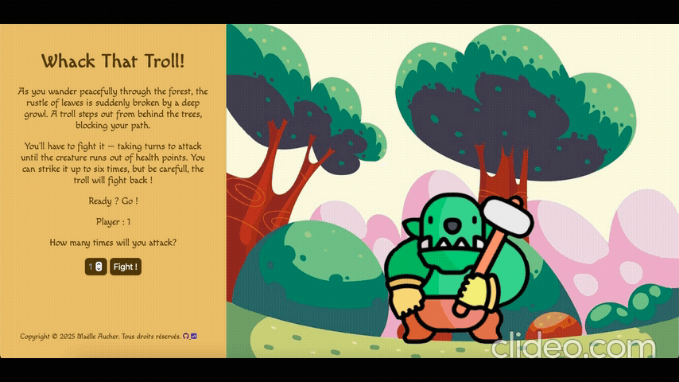

# 🧌 Whack That Troll!

Un petit jeu web où **deux joueurs** affrontent un **troll terrifiant** dans une sombre forêt 🌲.  
Chacun joue à tour de rôle et doit choisir d’**attaquer** ou d’**utiliser une stratégie** pour vaincre le troll avant qu’il ne les écrase !

---

## 🎮 Aperçu du jeu

Deux aventuriers s’enfoncent dans une forêt maudite…  
Mais un troll surgit !  
Le but du jeu : **survivre et vaincre le troll** avant que vos points de vie tombent à zéro.

Chaque joueur agit à tour de rôle :
- ⚔️ **Attaquer** : inflige des dégâts au troll (mais attention, il riposte !)
- 🛡️ **Se défendre** : réduit les dégâts du prochain coup
- 💊 **Soigner** : regagne quelques points de vie (si vous avez de la chance...)

Le premier à abattre le troll remporte la partie !

---

## 📁 Structure du projet

troll_game/
├── pictures/ # Images utilisées dans le jeu (troll, joueurs, forêt…)
├── index.html # Page principale du jeu
├── style.css # Feuille de style
├── script.js # Logique du jeu (attaques, tours, gestion des PV, etc.)
├── .gitattributes # Paramètres Git
└── .DS_Store # Fichier système (macOS, inutile pour le jeu)

## 🚀 Lancer le jeu

1. **Clone** le dépôt :
   ```bash
   git clone https://github.com/ton-utilisateur/troll_game.git

2. **clic**  :
   https://aucherm.github.io/troll_game/


🧠 Technologies utilisées

HTML5 – Structure de la page
CSS3 – Mise en forme et animations
JavaScript (ES6) – Gestion du gameplay et des tours
   
   
📸 Aperçu visuel 


